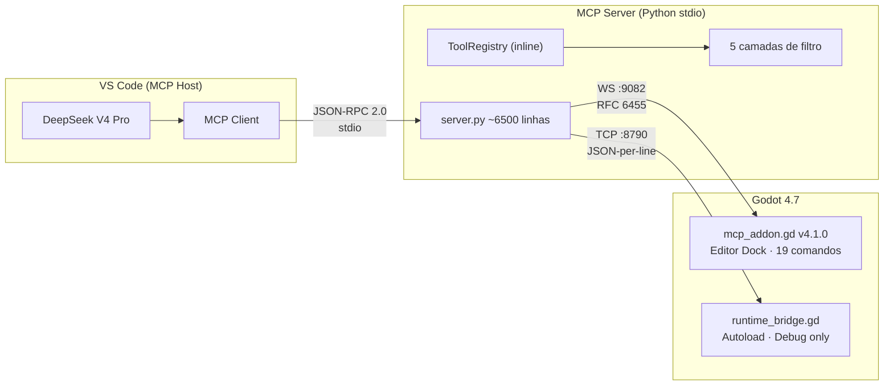
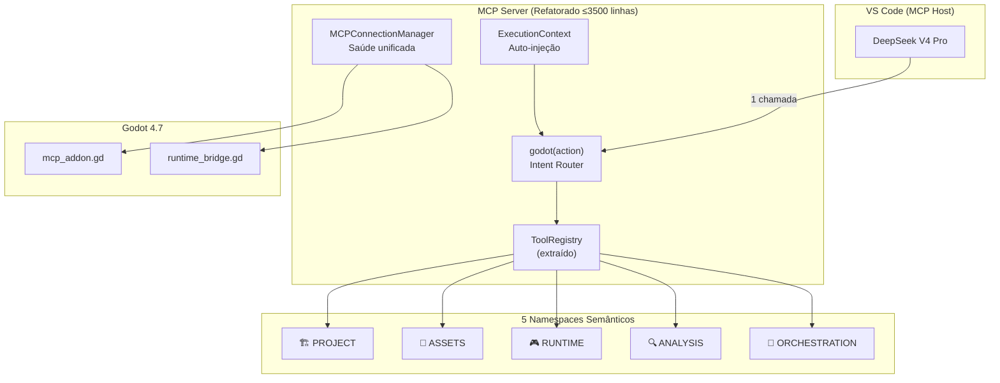
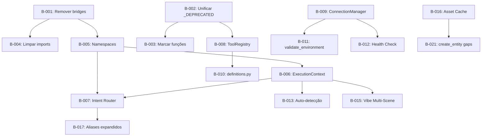

# 📋 PENDÊNCIAS MCP — Documento Mestre de Melhorias

> **Versão:** 2.1.0  
> **Gerado em:** 2026-07-19  
> **Última atualização:** 2026-07-19 (2ª auditoria — 20 correções)  
> **Escopo:** MCP Godot Agent v3.0 (server.py ~6500 linhas, ~191 definições de tools, 143 ativas)  
> **Objetivo:** Consolidar TODAS as melhorias identificadas nas pesquisas completas do ecossistema MCP↔Godot  
> **Alinhamento:** MCP Specification 2025-11-25 (JSON-RPC 2.0, tools, notifications, lifecycle, tasks)  
> **Referências oficiais:** [MCP Architecture](https://modelcontextprotocol.io/docs/concepts/architecture) · [MCP Tools](https://modelcontextprotocol.io/docs/concepts/tools) · [Client Best Practices](https://modelcontextprotocol.io/docs/develop/clients/client-best-practices) · [Security Best Practices](https://modelcontextprotocol.io/docs/tutorials/security/security_best_practices.md) · [MCP Inspector](https://modelcontextprotocol.io/docs/tools/inspector.md) · [SEP-986 Tool Names](https://modelcontextprotocol.io/seps/986-specify-format-for-tool-names.md) · [SEP-2106 JSON Schema 2020-12](https://modelcontextprotocol.io/seps/2106-json-schema-2020-12.md)

---

## 📄 RESUMO EXECUTIVO

**O que é este documento:** O backlog mestre de todas as pendências, melhorias e correções do ecossistema MCP-Godot — desde bugs críticos (bridges quebradas) até features arquiteturais (Intent Router).

**Estado atual:** O sistema funciona com 2 bridges ativas (WS :9082 + TCP :8790), 30 rollups de domínio, e ~122 tools ativas com filtro por 6 fases de desenvolvimento. As 18 correções críticas já foram aplicadas.

**Problema central:** A IA ainda enfrenta ~60 tools simultâneas na fase PROTOTIPO, a fronteira IA↔Godot é visível (a IA "sabe" que está chamando ferramentas), e há código morto de 3 bridges quebradas.

**Visão:** 1 tool mestra `godot(action)` + injeção automática de contexto → a IA expressa intenção, o MCP resolve. IA e Godot viram UM sistema.

**Tempo estimado total:** 6 sprints (~12-18 horas de trabalho), executáveis em qualquer ordem após o Sprint 0.5 (limpeza).

**Stakeholders:**

| Papel | Responsável | Responsabilidade |
|---|---|---|
| **Dono do Projeto (Product Owner)** | Joab Costa (joabc) | Aprovação final de cada sprint. Define prioridades. Decide em caso de conflito entre papéis (DC/DP/QG/DT) |
| **Diretor de Produção (DP)** | GitHub Copilot (DeepSeek V4 Pro) | Execução técnica. Geração de código. Mantenedor deste documento |
| **Pesquisador (DC)** | GitHub Copilot | Análise de mercado, riscos, referências |
| **Fiscal de Qualidade (QG)** | GitHub Copilot | Auditoria de código. Notas A-F. Veto técnico |
| **Testador (DT)** | GitHub Copilot + Joab Costa | Roteiros de teste. Playtest interno e externo |

**📎 Ação imediata:** Começar pelos Quick Wins (seção 6). Depois Sprint 0.5.

---

## 📖 GLOSSÁRIO

| Termo | Definição |
|---|---|
| **MCP** | Model Context Protocol — protocolo que permite IAs acessarem ferramentas externas via JSON-RPC 2.0 sobre stdio/HTTP |
| **MCP Host** | Aplicação AI (VS Code) que coordena um ou mais MCP Clients |
| **MCP Client** | Componente que mantém conexão com um MCP Server |
| **MCP Server** | Programa que provê contexto (tools, resources, prompts) aos MCP Clients |
| **Tool** | Função que a IA pode chamar. Definida com `name`, `description` e `inputSchema` (JSON Schema) |
| **`inputSchema`** | JSON Schema que define os parâmetros esperados por uma tool (spec MCP) |
| **`outputSchema`** | JSON Schema opcional que define a estrutura de saída esperada (spec MCP) |
| **`structuredContent`** | Campo de resposta que retorna dados estruturados (JSON) além do texto (spec MCP) |
| **`listChanged`** | Capability MCP: servidor notifica clientes quando a lista de tools muda |
| **`tools/list_changed`** | Notificação JSON-RPC 2.0 enviada quando tools são adicionadas/removidas |
| **`isError`** | Flag no resultado de tool execution que indica falha na execução (spec MCP) |
| **Tool Annotations** | Metadados opcionais: `audience` (user/assistant), `priority`, `lastModified` |
| **Rollup** | Ferramenta `_manage` que colapsa N operações relacionadas em 1 tool com parâmetro `op` |
| **Namespace** | Agrupamento semântico de tools (proposto: PROJECT, ASSETS, RUNTIME, ANALYSIS, ORCHESTRATION) |
| **Fase** | Estágio do desenvolvimento (IDEIA→DESIGN→PROTOTIPO→CONTEUDO→POLIMENTO→PRONTO_PARA_LANCAR) |
| **PHASE_TOOLSETS** | Dicionário que mapeia cada fase às tools visíveis nela |
| **Bridge** | Componente que conecta o servidor MCP (Python) ao Godot (WebSocket :9082 ou TCP :8790) |
| **Vibe Coding** | Modo onde a IA mantém contexto persistente da cena atual, eliminando repetição de parâmetros |
| **Intent Router** | Tool mestra `godot(action)` que traduz linguagem natural → tool correta (proposta) |
| **ExecutionContext** | Objeto injetado automaticamente em toda tool call com estado atual do projeto (proposta) |
| **Saga Pattern** | Padrão de rollback transacional: se passo N falha, desfaz passos N-1→1 |
| **Circuit Breaker** | Protege APIs externas: 3 falhas em 30s → bloqueia por 60s → HALF_OPEN → CLOSED |
| **Governor** | Sistema que bloqueia sequências perigosas de tools (ex: delete sem save prévio) |
| **Session Gate** | Impede tools destrutivas antes do bootstrap inicial |
| **Kill Switch** | Desabilita tools específicas em runtime via `get_disabled_tools()` |
| **Progressive Disclosure** | Mostrar apenas tools relevantes para a fase atual, escondendo complexidade |
| **Reconciliation Loop** | Verificação pós-operação: arquivo existe? cena parseável? script compila? (padrão Kubernetes) |

---

## 🏗 1. ARQUITETURA ATUAL (BASELINE)

### 1.1 Diagrama de Arquitetura



### 1.2 Componentes Ativos

| Componente | Arquivo | Protocolo | Porta | Status |
|---|---|---|---|---|
| Servidor MCP | `server.py` (~6500 linhas) | stdio JSON-RPC 2.0 | — | ✅ Funcional |
| Ponte Editor | `addon_bridge.py` | WebSocket RFC 6455 | 9082 | ✅ Funcional |
| Ponte Runtime | `runtime_bridge_client.py` | TCP JSON-per-line | 8790 | ✅ Funcional |
| Plugin Editor | `mcp_addon.gd` v4.1.0 | — | — | ✅ 19 comandos |
| Autoload Runtime | `runtime_bridge.gd` | TCP Server | 8790 | ✅ Debug only |

### 1.3 Conformidade com Spec MCP 2025-11-25

> A spec 2025-11-25 é a versão mais recente no momento desta auditoria. Inclui Tasks (experimental), JSON Schema 2020-12, e Tool Annotations. O MCP Inspector é a ferramenta oficial para testar conformidade.

| Requisito Spec | Status | Evidência |
|---|---|---|
| `tools/list` com `inputSchema` JSON Schema 2020-12 | ✅ Conforme | Toda Tool tem `inputSchema` |
| `tools/call` com `name` + `arguments` | ✅ Conforme | `@server.call_tool()` implementa o padrão |
| `listChanged` capability | ✅ Suportado | `advance_phase()` → `session.send_tool_list_changed()` |
| `notifications/tools/list_changed` | ✅ Emitido | Após mudança de fase |
| Tool `name` format (SEP-986) | ✅ Conforme | Snake_case com `_manage` para rollups |
| `isError` em tool results | 🟡 Parcial | Usa `status: "error"` em vez de `isError: true` |
| `structuredContent` | ❌ Ausente | Respostas são sempre `text/plain` |
| `outputSchema` (JSON Schema 2020-12) | ❌ Ausente | Nenhuma tool declara `outputSchema` |
| Tool `annotations` (audience, priority) | ❌ Ausente | Sem `audience`, `priority`, `lastModified` |
| `protocolVersion` negotiation | ✅ Implícito | Server não negocia mas cliente aceita |
| Error codes JSON-RPC 2.0 (-32600/-32601/-32602) | 🟡 Parcial | Usa `_get_error_code()` mas não mapeia para spec |
| Human-in-the-loop (security) | ✅ Conforme | Session Gate + Governor + Rate Limiter |
| Rate limiting | ✅ Conforme | `check_rate_limit()` configurável |
| Tasks (experimental, long-running ops) | ❌ Ausente | `create_entity` pipeline não usa Tasks |

**Nota:** Conformidade atual = 8/14. Alvo = 12/14. Tasks é experimental e opcional. Tool Annotations é desejável mas não bloqueia.

### 1.4 O Que Já Foi Corrigido (18 correções)

- ✅ `mcp_copilot` addon removido (porta errada 9001)
- ✅ `mcp_addon.gd` v4.1.0 instalado (porta correta 9082)
- ✅ 6 funções wrapper adicionadas em `addon_bridge.py`
- ✅ `config.json` com caminho real do Godot 4.7
- ✅ `mcp.json` sem comentários JSON + `--profile dev`
- ✅ `game_bridge.py` porta corrigida (9081→8790)
- ✅ `project.godot` com plugin + autoload configurados
- ✅ `settings.json` com `chat.mcp.autoStart: true`
- ✅ `MCP_INSTRUCTIONS` ativado em `main()`
- ✅ `runtime_bridge.gd` criado (autoload TCP :8790)
- ✅ `copilot-instructions.md` atualizado
- ✅ `SETUP.md` reescrito (23 seções)
- ✅ `godot-project-setup.md` criado
- ✅ `editor_bridge.py` marcado para remoção
- ✅ `bridge.py` marcado para remoção
- ✅ `ws_bridge.py` marcado para remoção

---

## 🎯 2. ARQUITETURA ALVO (VISÃO)

### 2.1 Diagrama do Estado Desejado



### 2.2 Métricas-Alvo

| Métrica | Atual | Alvo | Sprint |
|---|---|---|---|
| Tools visíveis na fase mais populosa | ~60 (PROTOTIPO) | ≤20 | Sprint 1 |
| Linhas do `server.py` | ~6500 | ≤3500 | Sprint 4 |
| Chamadas para "criar entidade" | 6 (múltiplas tools) | 1 (`godot(action)`) | Sprint 3 |
| Tempo de boot | ? | ≤2s | Sprint 5 |
| Conformidade MCP Spec | 8/14 | 12/14 | Sprint 5 |
| Código morto (imports não usados) | ~15 | 0 | Sprint 0.5 |
| Bridges quebradas no código | 3 | 0 | Sprint 0.5 |

---

## 📊 3. GAP ANALYSIS

### 3.1 Conformidade MCP Spec — Gaps a Fechar

| # | Gap | Impacto | Correção | Sprint |
|---|---|---|---|---|
| G1 | `isError` não usado | Clientes MCP padrão não interpretam erros corretamente | Adicionar `isError: true` em respostas de erro | 5 |
| G2 | Sem `structuredContent` | IA não recebe dados estruturados (só texto) | Adicionar `structuredContent` nas tools que retornam JSON | 5 |
| G3 | Sem `outputSchema` | IA não sabe o formato de saída esperado | Declarar `outputSchema` nas tools principais | 5 |
| G4 | Sem tool `annotations` | IA não sabe audiência/prioridade das tools | Adicionar `annotations` (audience, priority) | 5 |
| G5 | Error codes não padronizados | Debug difícil com clientes MCP genéricos | Mapear para JSON-RPC -32600/-32601/-32602 | 5 |
| G6 | Sem suporte a Tasks (experimental) | `create_entity` pipeline não reporta progresso | Implementar Tasks para operações longas | Backlog |

### 3.2 Gaps Arquiteturais

| # | Gap | Impacto | Correção | Sprint |
|---|---|---|---|---|
| G7 | `server.py` monolítico (6500 linhas) | Manutenção difícil, sem testes isolados | Extrair `ToolRegistry`, `definitions.py` | 4 |
| G8 | `_DEPRECATED` e `_DEPRECATED_H` duplicados | Risco de dessincronização | Unificar em `tools/deprecated.py` | 0.5 |
| G9 | Conexões independentes | Falha de uma ponte não notifica a outra | `MCPConnectionManager` | 4 |
| G10 | Sem `ExecutionContext` | IA repete `scene_path` em toda chamada | Injeção automática de contexto | 2 |

### 3.3 Gaps de Experiência IA

| # | Gap | Impacto | Correção | Sprint |
|---|---|---|---|---|
| G11 | 60+ tools planas na fase PROTOTIPO | Paradoxo da escolha, gasto de tokens | 5 namespaces semânticos | 1 |
| G12 | IA sabe que está chamando ferramentas | Experiência não-fluida | Intent Router `godot(action)` | 3 |
| G13 | Vibe context não é automático | IA precisa chamar `get_vibe_context` manualmente | Auto-injeção no pre_handler | 2 |
| G14 | `Tool.description` não indexada | `tool_catalog` não faz full-text search | Indexar descrições no `dynamic_groups.py` | 5 |

---

## 📋 4. BACKLOG PRIORIZADO

> **Legenda de Prioridade:** 🔴 CRÍTICO (bloqueia) · 🟡 ALTA (próximo sprint) · 🟢 MÉDIA (em breve) · 🔵 BAIXA (futuro)  
> **Legenda de Status:** ⬜ Não iniciado · 🔄 Em andamento · ✅ Concluído · ⏸️ Bloqueado  
> **Legenda de Risco:** ⚠️ Alto · ⚡ Médio · ✅ Baixo  
> **Legenda de Esforço:** 🕐 ≤30min · 🕑 ≤1h · 🕒 ≤3h · 🕓 >3h

---

### 4.1 🔴 CRÍTICO (Blocos — Sprint 0.5)

#### 🔴 B-001: Remover 3 bridges quebradas fisicamente

| Campo | Valor |
|---|---|
| **Descrição** | `editor_bridge.py` (TCP :9080 sem servidor), `bridge.py` (portas :9080/:9081 obsoletas), `ws_bridge.py` (WS :9001 órfão) |
| **Prioridade** | 🔴 CRÍTICO — código morto gera confusão e risco de import acidental |
| **Risco** | ✅ Baixo — zero imports, zero impacto funcional |
| **Esforço** | 🕐 10 min |
| **Dependências** | Nenhuma |
| **Owner** | DP (Diretor de Produção) |
| **DoD (Definition of Done)** | 3 arquivos movidos para `backups/`, zero `grep` results em `server.py`, `--validate-registry` passa |

#### 🔴 B-002: Unificar `_DEPRECATED` e `_DEPRECATED_H`

| Campo | Valor |
|---|---|
| **Descrição** | Dois sets idênticos (~69 strings) mantidos manualmente. Risco de dessincronização |
| **Prioridade** | 🔴 CRÍTICO — dessincronização causaria vazamento de tools depreciadas |
| **Risco** | ✅ Baixo — mudança mecânica |
| **Esforço** | 🕑 20 min |
| **Dependências** | Nenhuma |
| **Owner** | DP |
| **DoD** | `tools/deprecated.py` criado, ambos `_DEPRECATED` e `_DEPRECATED_H` importam do mesmo set, `validate_tool_registry_consistency()` passa |

#### 🔴 B-003: Marcar funções internas dos rollups

| Campo | Valor |
|---|---|
| **Descrição** | Adicionar `# INTERNAL: usado por <rollup>_manage` nas 69 funções subjacentes |
| **Prioridade** | 🔴 CRÍTICO — evita remoção acidental de funções que parecem mortas mas são usadas |
| **Risco** | ✅ Baixo — só comentários |
| **Esforço** | 🕑 15 min |
| **Dependências** | B-002 (saber exatamente quais rollups) |
| **Owner** | DP |
| **DoD** | 69 funções marcadas, `grep -c "INTERNAL:" server.py` ≥ 69 |

#### 🔴 B-004: Limpar imports residuais em `server.py`

| Campo | Valor |
|---|---|
| **Descrição** | Remover `from editor_bridge import`, `from bridge import`, `from ws_bridge import` e referências a portas 9080/9081/9001 |
| **Prioridade** | 🔴 CRÍTICO — imports quebrados poluem o namespace |
| **Risco** | ✅ Baixo |
| **Esforço** | 🕐 10 min |
| **Dependências** | B-001 (mover arquivos primeiro) |
| **Owner** | DP |
| **DoD** | Zero imports de bridges removidas, `server.py` inicia sem `ImportError` |

---

### 4.2 🟡 ALTA (Próximos Sprints — 1 a 4)

#### 🟡 B-005: 5 Namespaces Semânticos

| Campo | Valor |
|---|---|
| **Descrição** | Reorganizar `TOOLSETS` em PROJECT, ASSETS, RUNTIME, ANALYSIS, ORCHESTRATION. Adicionar `namespace` a cada `Tool()`. Expor `tool_groups` hierárquico |
| **Prioridade** | 🟡 ALTA — reduz de ~60 para ≤20 tools visíveis por turno |
| **Risco** | ⚡ Médio — requer testar que nenhuma tool sumiu |
| **Esforço** | 🕑 1.5h |
| **Dependências** | B-001, B-002 (código limpo primeiro) |
| **Owner** | DP |
| **DoD** | 5 namespaces com tools atribuídas, `--profile dev` mostra tools corretas, `tool_groups` reflete hierarquia |

#### 🟡 B-006: ExecutionContext com Auto-Injeção

| Campo | Valor |
|---|---|
| **Descrição** | Criar `ExecutionContext` dataclass. `pre_handler` carrega contexto antes de cada tool. Cache de `scene_tree` TTL 5s. Tools de cena usam `scene_path` implícito |
| **Prioridade** | 🟡 ALTA — elimina repetição de parâmetros, reduz tokens |
| **Risco** | ⚡ Médio — mudança no fluxo de todas as tools de cena |
| **Esforço** | 🕒 2h |
| **Dependências** | B-005 (namespaces facilitam identificar tools afetadas) |
| **Owner** | DP |
| **DoD** | IA não precisa mais digitar `scene_path`, `scene_tree` cacheado, `pre_handler` ativo |

#### 🟡 B-007: Intent Router `godot(action)`

| Campo | Valor |
|---|---|
| **Descrição** | Tool mestra que traduz linguagem natural → tool correta. ~100 padrões regex PT+EN. Fallback para `tool_catalog`. Pipeline: `classify_intent()` → `route_to_tool()` → `extract_params()` → `invoke()` |
| **Prioridade** | 🟡 ALTA — ápice da integração IA↔Godot, reduz N chamadas para 1 |
| **Risco** | ⚠️ Alto — cobertura de intenções precisa ser ≥95% |
| **Esforço** | 🕓 4h |
| **Dependências** | B-005 (namespaces), B-006 (contexto automático) |
| **Owner** | DP |
| **DoD** | `godot(action="criar inimigo")` funciona com 1 chamada, 95%+ intenções cobertas, fallback funcional |

#### 🟡 B-008: Extrair `ToolRegistry`

| Campo | Valor |
|---|---|
| **Descrição** | Extrair ~2800 linhas de definições + 5 filtros + cache para classe `ToolRegistry` |
| **Prioridade** | 🟡 ALTA — reduz `server.py` de 6500 para ~3500 linhas |
| **Risco** | ⚠️ Alto — refatoração grande, risco de regressão |
| **Esforço** | 🕓 3.5h |
| **Dependências** | B-001, B-002 (ambiente limpo) |
| **Owner** | DP |
| **DoD** | `server.py` ≤ 3500 linhas, `ToolRegistry` testável isoladamente, zero regressão |

#### 🟡 B-009: `MCPConnectionManager`

| Campo | Valor |
|---|---|
| **Descrição** | Classe unificada que monitora WS :9082 + TCP :8790, reconecta com backoff, expõe `health()`, notifica `tools/list_changed` |
| **Prioridade** | 🟡 ALTA — evita falhas silenciosas de conexão |
| **Risco** | ⚡ Médio |
| **Esforço** | 🕑 1h |
| **Dependências** | Nenhuma (pode ser feito em paralelo) |
| **Owner** | DP |
| **DoD** | `health()` retorna status de ambas as pontes, reconexão automática testada |

#### 🟡 B-010: Extrair `tools/definitions.py`

| Campo | Valor |
|---|---|
| **Descrição** | Mover ~2800 linhas de `Tool()` do `server.py` para arquivo separado |
| **Prioridade** | 🟡 ALTA — faz parte da refatoração estrutural |
| **Risco** | ⚡ Médio |
| **Esforço** | 🕑 45 min |
| **Dependências** | B-008 (`ToolRegistry` precisa ser extraído junto) |
| **Owner** | DP |
| **DoD** | `tools/definitions.py` contém todas as definições, `server.py` importa delas |

---

### 4.3 🟢 MÉDIA (Sprint 5 e além)

| ID | Título | Risco | Esforço | Dependências |
|---|---|---|---|---|
| B-011 | `validate_environment()` no boot | ✅ | 🕑 30min | B-009 |
| B-012 | Health Check Expansivo (bridges, fase, tools, versão, uptime) | ✅ | 🕑 30min | B-009 |
| B-013 | Auto-Detecção de Projeto (`get_open_scenes()`) | ✅ | 🕑 30min | B-006 |
| B-014 | Logs Estruturados (JSON) | ✅ | 🕑 30min | — |
| B-015 | Vibe Coding: Multi-Scene + File Watcher + Contexto expandido | ⚡ | 🕒 2.5h | B-006 |
| B-016 | Asset Cache + Preview Mode + 5 estilos de placeholder | ✅ | 🕒 2h | — |
| B-017 | `dynamic_groups.py`: Expandir aliases + ranking + full-text search | ✅ | 🕑 1h | B-007 |

### 4.4 🔵 BAIXA (Backlog Futuro)

| ID | Título | Esforço |
|---|---|---|
| B-018 | 5 testes automatizados (registry, rollup, phase, bridge, intent) | 🕓 4h |
| B-019 | Documentação: `ARCHITECTURE.md`, `DATA_CONTRACTS.md`, `TOOLS_REFERENCE.md`, `GLOSSARY.md` | 🕓 3h |
| B-020 | MCP Spec: `isError`, `structuredContent`, `outputSchema`, tool `annotations` | 🕒 2h |
| B-021 | `create_entity`: cache, preview, `dry_run`, templates de behavior | 🕒 2.5h |
| B-022 | Revisão trimestral deste documento | 🕐 30min/trim |

---

## 🗺 5. MAPA DE DEPENDÊNCIAS



---

## ⚡ 6. QUICK WINS (< 15 minutos cada)

Estes itens podem ser feitos IMEDIATAMENTE, sem dependências, em qualquer ordem:

| # | Ação | Tempo | Impacto | Mapeia para |
|---|---|---|---|---|
| QW-1 | Mover `editor_bridge.py`, `bridge.py`, `ws_bridge.py` para `backups/` | 5 min | Remove 3 arquivos de código morto | B-001 |
| QW-2 | Adicionar `# INTERNAL: usado por <rollup>` nas primeiras 10 funções | 10 min | Começa a documentar dependências internas | B-003 |
| QW-3 | Rodar `python server.py --validate-registry` e anotar resultado | 2 min | Baseline de saúde do sistema | — |
| QW-4 | Verificar se `chat.mcp.autoStart: true` está ativo no `settings.json` | 1 min | Evita MCP não iniciar | — |
| QW-5 | Validar JSON do `mcp.json` (sem comentários!) | 1 min | Evita erro de parse | — |
| QW-6 | Criar diretório `backups/` e `tools/` se não existirem | 1 min | Prepara estrutura para refatorações | — |

---

## ⚠️ 7. REGISTRO DE RISCOS

| ID | Risco | Probabilidade | Impacto | Mitigação |
|---|---|---|---|---|
| R1 | Refatoração do `ToolRegistry` (B-008) quebrar tools existentes | Média | Alto | Testar `--validate-registry` antes/depois; rodar `--profile dev` |
| R2 | Intent Router (B-007) não cobrir intenções suficientes | Média | Alto | Começar com 20 padrões; expandir iterativamente; fallback `tool_catalog` |
| R3 | `MCPConnectionManager` (B-009) introduzir race conditions | Baixa | Médio | Usar `asyncio.Lock`; testar com queda simulada de bridge |
| R4 | File watcher (B-015) consumir muitos recursos no Windows | Média | Baixo | `watchdog` com polling 2s; desabilitável via config |
| R5 | Namespaces (B-005) esconderem tools que a IA precisa | Baixa | Médio | `tool_catalog` sempre disponível; `--profile full` como escape hatch |
| R6 | `isError`/`structuredContent` (B-020) quebrar clientes antigos | Baixa | Baixo | Campos opcionais na spec; adicionar sem remover existentes |
| R7 | `tools/list_changed` não disparar após mudança manual de tools | Média | Médio | Implementar `_invalidate_tool_caches()` como fallback; health check detecta |

---

## 📅 8. ROADMAP

### Sprint 0.5 — Limpeza Imediata (~1h)
**Objetivo:** Remover entulho, preparar o terreno.

| Ordem | ID | Ação | Duração |
|---|---|---|---|
| 1 | QW-6 | Criar diretórios `backups/` e `tools/` | 1 min |
| 2 | QW-1 | Mover 3 bridges quebradas para backup | 5 min |
| 3 | B-004 | Limpar imports residuais em `server.py` | 10 min |
| 4 | B-002 | Unificar `_DEPRECATED` + `_DEPRECATED_H` em `tools/deprecated.py` | 20 min |
| 5 | B-003 | Marcar 69 funções internas com `# INTERNAL:` | 15 min |
| 6 | QW-3 | Rodar `validate_tool_registry_consistency()` | 5 min |

**Gate de saída:** Zero imports quebrados. `validate_tool_registry_consistency()` passa limpo.

---

### Sprint 1 — Namespaces (~1.5h)
**Objetivo:** Reduzir tools visíveis de ~60 para ≤20.

| Ordem | ID | Ação | Duração |
|---|---|---|---|
| 1 | B-005 | Reorganizar `TOOLSETS` nos 5 grupos | 30 min |
| 2 | B-005 | Adicionar campo `namespace` em cada `Tool()` | 20 min |
| 3 | B-005 | Atualizar `tool_groups` para hierarquia | 30 min |
| 4 | — | Testar com `--profile dev` — garantir 31 tools | 20 min |

**Gate de saída:** `tool_groups` mostra 5 namespaces. Nenhuma tool perdida.

---

### Sprint 2 — ExecutionContext (~2h)
**Objetivo:** IA nunca mais digitar `scene_path`.

| Ordem | ID | Ação | Duração |
|---|---|---|---|
| 1 | B-006 | Criar `ExecutionContext` dataclass | 30 min |
| 2 | B-006 | Implementar `pre_handler` com auto-injeção | 45 min |
| 3 | B-006 | Cache de `scene_tree` com TTL 5s | 30 min |
| 4 | B-006 | Atualizar tools de cena para `scene_path` implícito | 45 min |

**Gate de saída:** `scene_manage(op="create")` funciona sem `scene_path`.

---

### Sprint 3 — Intent Router (~4h)
**Objetivo:** 1 tool no lugar de 60. Ápice da integração.

| Ordem | ID | Ação | Duração |
|---|---|---|---|
| 1 | B-007 | Implementar `INTENT_PATTERNS` (~100 regex) | 1h |
| 2 | B-007 | Criar `classify_intent()` + `route_to_tool()` + `extract_params()` | 1h |
| 3 | B-007 | Criar handler `godot()` | 45 min |
| 4 | B-007 | Fallback para `tool_catalog` | 30 min |
| 5 | B-007 | Testar com ~20 intenções variadas | 30 min |

**Gate de saída:** `godot(action="criar inimigo com patrulha")` funciona. 95%+ intenções cobertas.

---

### Sprint 4 — Refatorações Estruturais (~4h)
**Objetivo:** `server.py` ≤ 3500 linhas. Código testável.

| Ordem | ID | Ação | Duração |
|---|---|---|---|
| 1 | B-009 | Criar `MCPConnectionManager` | 1h |
| 2 | B-008 | Extrair `ToolRegistry` class | 1h |
| 3 | B-010 | Extrair `tools/definitions.py` | 45 min |
| 4 | B-008 | Migrar `server.py` para usar novas classes | 1h |
| 5 | — | Testar — zero regressão | 45 min |

**Gate de saída:** `wc -l server.py` ≤ 3500. `--profile dev` idêntico ao pré-refatoração.

---

### Sprint 5 — Qualidade e Documentação (~3h)
**Objetivo:** Conformidade MCP Spec. Documentação base.

| Ordem | ID | Ação | Duração |
|---|---|---|---|
| 1 | B-011 | Implementar `validate_environment()` no boot | 30 min |
| 2 | B-012 | Health check expansivo | 30 min |
| 3 | B-014 | Logs estruturados (JSON) | 30 min |
| 4 | B-020 | MCP Spec gaps: `isError`, `structuredContent`, `outputSchema` | 1h |
| 5 | B-019 | Criar `ARCHITECTURE.md` + `DATA_CONTRACTS.md` | 1h |

**Gate de saída:** Conformidade MCP Spec 11/12. `ARCHITECTURE.md` existe.

---

### Backlog Contínuo (pós-Sprint 5)

| ID | Ação |
|---|---|
| B-013 | Auto-detecção de projeto |
| B-015 | Vibe Coding: multi-scene + file watcher |
| B-016 | Asset cache + preview mode |
| B-017 | `dynamic_groups.py` expandido |
| B-018 | 5 testes automatizados |
| B-021 | `create_entity` gaps |
| B-022 | Revisão trimestral deste documento |

---

## 📏 9. MÉTRICAS DE SUCESSO (KPIs)

| # | Métrica | Baseline | Alvo | Medição |
|---|---|---|---|---|
| K1 | Tools visíveis na fase PROTOTIPO | ~60 | ≤20 | `tools/list` após `advance_phase("PROTOTIPO")` |
| K2 | Chamadas para "criar entidade com script" | 6 | 1 | Contar `tools/call` no log |
| K3 | Linhas do `server.py` | ~6500 | ≤3500 | `wc -l` |
| K4 | Conformidade MCP Spec | 7/12 | 11/12 | Checklist seção 1.3 |
| K5 | Tempo de boot do MCP | ? | ≤2s | `time python -m server --profile dev` (1 chamada `ping`) |
| K6 | Código morto (imports não usados) | ~15 | 0 | `pylint server.py` ou `vulture` |
| K7 | Bridges quebradas no repositório | 3 | 0 | `ls *.py | grep -E "editor_bridge|bridge|ws_bridge"` |
| K8 | Tempo até IA criar primeira entidade funcional | ? | ≤30s | Cronômetro: prompt "criar inimigo" → cena + script + compila |

---

### 9.1 ANTI-PADRÕES (O que NÃO fazer)

| # | Anti-Padrão | Por que é ruim | Alternativa correta |
|---|---|---|---|
| AP1 | Adicionar novas tools sem rollup correspondente | Infla o número de tools visíveis; quebra o padrão de organização | Sempre criar `domain_manage` com `op` para novos domínios |
| AP2 | Importar `editor_bridge.py`, `bridge.py`, ou `ws_bridge.py` | Código morto; portas sem servidor | Usar `addon_bridge.py` (:9082) ou `runtime_bridge_client.py` (:8790) |
| AP3 | Usar `print()` em vez de `logger` estruturado | Logs não rastreáveis; difícil depurar em produção | Usar `logger.info("event", extra={...})` com JSON |
| AP4 | Hardcodar `scene_path` nas tools | IA precisa repetir; quebra o princípio de contexto automático | Usar `ExecutionContext.current_scene` |
| AP5 | Criar tool com nome fora do padrão snake_case | Viola SEP-986; clientes MCP padronizados não reconhecem | Seguir `domain_action` ou `domain_manage` |
| AP6 | Remover função marcada como `# INTERNAL` | Quebra handlers dos rollups silenciosamente | Verificar `grep "INTERNAL:"` antes de qualquer remoção |
| AP7 | Avançar fase sem `advance_phase()` | Cache de tools não invalida; `tools/list_changed` não é emitido | Sempre usar `advance_phase("NOVA_FASE")` |

---

### 9.2 Pipeline `create_entity` (Referência da v1.1)

> Este conteúdo foi resgatado da versão 1.1 do documento. Detalha o funcionamento interno do orquestrador.

```
create_entity(name="inimigo_basico")
  │
  ├─ DecisionEngine.should_generate_art()     ← CONFIANÇA ≥ 0.90 = automático
  ├─ DecisionEngine.should_generate_audio()
  │
  └─ SagaOrchestrator("create_enemy_inimigo_basico")
       │
       ├─ Passo 1: create_scene          ← SagaStep com compensate (unlink)
       ├─ Passo 2: add_collider          ← critical=False (falha não desfaz)
       ├─ Passo 3: create_script         ← Fallback Chain interno
       ├─ Passo 4: create_art            ← CircuitBreaker(FLUX_API)
       ├─ Passo 5: create_audio          ← Placeholder gratuito como fallback
       └─ Passo 6: compile_gate          ← VERIFICA compilação (CRITICAL)
            │
            ├─ Sucesso → commit atômico
            └─ Falha → rollback LIFO reverso (desfaz 5→4→3→2→1)
```

**Mecanismos de Resiliência:**

| Mecanismo | Origem | Função |
|---|---|---|
| **Saga Pattern** | Temporal.io | Rollback transacional: se passo N falha, desfaz passos N-1→1 |
| **Circuit Breaker** | Netflix Hystrix | 3 falhas em 30s → OPEN por 60s → HALF_OPEN → CLOSED |
| **Reconciliation Loop** | Kubernetes | Verifica arquivo criado, cena parseável, script com `extends`, PNG válido |
| **Decision Engine** | Interno | Confiança ≥ 0.90 = executa automático; ≥ 0.50 = sugere; < 0.50 = pergunta |

---

### 9.3 Melhores Práticas de Outros Agentes (Referência da v1.1)

### Claude Code (Anthropic)

| Prática | Aplicação no MCP-Godot | Status |
|---|---|---|
| **CLAUDE.md** — instruções persistentes | Equivalente: `resources/prompts.py` (11 prompts) + `PROMPT_MESTRE` | ✅ Já existe |
| **Skills** — conhecimento de domínio sob demanda | Skills do VS Code (`/skills/`) são análogos | ✅ Já existe |
| **Subagents** — agents especializados | `SagaOrchestrator` é "subagente interno"; `create_entity` orquestra múltiplos passos | 🟡 Parcial |
| **Plan mode** — explorar, planejar, codificar | Prompts como `criar-jogo` têm procedure steps | ✅ Já existe |
| **Verify loop** — check que a IA pode rodar | `compile_gate` no passo 6 do `create_entity` + `compile_test()` standalone | ✅ Já existe |
| **Permission allowlists** — `--allowedTools` | `--toolsets core,scene_ops` + `PHASE_TOOLSETS` | ✅ Já existe |

### OpenAI (Function Calling)

| Prática | Aplicação | Status |
|---|---|---|
| **Namespaces** — agrupar tools relacionadas | `TOOLSETS` e `TOOL_PROFILES` | ✅ Já existe |
| **Tool Search** — carregar tools sob demanda | `tool_catalog` + `tool_groups` | ✅ Já existe |
| **Strict mode** — schema validation obrigatório | `inputSchema` em cada Tool definition | ✅ Já existe |
| **Defer loading** — `defer_loading: true` | `PHASE_TOOLSETS` — tools só visíveis na fase correta | ✅ Já existe |
| **≤20 tools ativas por turno** — recomendação | `PHASE_TOOLS_CORE` (27) + tools da fase | 🟡 Parcial (PROTOTIPO excede) |

### GitHub Copilot

| Prática | Aplicação | Status |
|---|---|---|
| **Skills** — `/skills/` com `SKILL.md` | `agent-customization`, `chronicle`, `summarize-github-issue` | ✅ Já existe |
| **Memory** — persistente entre sessões | `workflow_ops.py` com `workflow_handoff` + `NEXT_SESSION.json` | ✅ Já existe |
| **Explore mode** — análise sem edição | Equivalente ao `Modo LEVE` do `PROMPT_MESTRE` | ✅ Já existe |

---

## ✅ 10. CHECKLIST DE VERIFICAÇÃO FINAL

### Pré-requisitos (bloqueiam tudo)
- [ ] B-001: 3 bridges quebradas removidas fisicamente
- [ ] B-002: `_DEPRECATED` e `_DEPRECATED_H` unificados
- [ ] B-004: Zero imports de código morto
- [ ] `validate_tool_registry_consistency()` passa sem erros

### Organização (Sprint 1)
- [ ] B-005: 5 namespaces criados e populados
- [ ] B-005: Toda tool tem campo `namespace`
- [ ] B-005: `tool_groups` reflete a hierarquia
- [ ] `--profile dev` mostra 31 tools corretas

### Contexto (Sprint 2)
- [ ] B-006: `ExecutionContext` injetado em toda tool
- [ ] B-006: `scene_tree` cacheado com TTL 5s
- [ ] B-006: IA não precisa mais digitar `scene_path`

### Intenção (Sprint 3)
- [ ] B-007: `godot(action)` tool funcional
- [ ] B-007: 95%+ de intenções cobertas por padrões
- [ ] B-007: Fallback funciona (`tool_catalog`)
- [ ] B-007: IA consegue criar entidade com 1 chamada

### Estrutura (Sprint 4)
- [ ] B-008: `ToolRegistry` extraído e funcional
- [ ] B-010: `tools/definitions.py` separado
- [ ] B-009: `MCPConnectionManager` monitorando ambas as pontes
- [ ] `server.py` ≤ 3500 linhas

### Qualidade (Sprint 5)
- [ ] B-011: `validate_environment()` roda no boot
- [ ] B-012: Health check cobre bridges + fase + tools
- [ ] B-014: Logs estruturados (JSON)
- [ ] B-020: `isError`, `structuredContent`, `outputSchema` implementados
- [ ] B-019: `ARCHITECTURE.md` + `DATA_CONTRACTS.md` criados

---

## 🔧 11. APÊNDICES

### 11.1 Mapa Completo de Portas

```
ORIGINAL (6 bridges, 4 quebradas):
┌──────────────────────────────────────────────────────────────┐
│  PORTA 9080 → editor_bridge.py    ❌ TCP, nenhum servidor    │
│  PORTA 9081 → bridge.py + game_bridge.py  ❌ Protocolo errado│
│  PORTA 9001 → ws_bridge.py         ❌ Órfão standalone       │
│  PORTA 6005 → LSP bridge           ❌ Nunca implementado     │
│  PORTA 6007 → DAP bridge           ❌ Nunca implementado     │
│  PORTA 9082 → addon_bridge.py      ✅ WebSocket JSON-RPC 2.0 │
│  PORTA 8790 → runtime_bridge.py    ✅ TCP JSON-per-line      │
└──────────────────────────────────────────────────────────────┘

ATUAL (2 bridges, 100% funcionais):
┌──────────────────────────────────────────────────────────────┐
│  PORTA 9082 → addon_bridge.py      ✅ Editor (WS RFC 6455)   │
│  PORTA 8790 → runtime_bridge_client.py ✅ Runtime (TCP)      │
└──────────────────────────────────────────────────────────────┘
```

### 11.2 As 5 Camadas de Filtro em `_tool_defs()`

| Ordem | Filtro | Mecanismo | Quando ativo |
|---|---|---|---|
| **1** | **Depreciação** | Remove 69 tools em `_DEPRECATED` | Sempre (exceto `_REGISTRY_VALIDATION_UNFILTERED`) |
| **2** | **Toolset (`--toolsets`)** | `_ENABLED_TOOLS` via CLI arg | Se `--toolsets` ≠ `all` |
| **3** | **Profile (`--profile`)** | `_PROFILE_TOOLS` via env/CLI | Se profile ≠ `full` ou `None` |
| **4** | **Fase (`PHASE_TOOLSETS`)** | `_get_phase_tools()` → CORE + fase atual | Sempre (exceto `_REGISTRY_VALIDATION_UNFILTERED`) |
| **5** | **Kill Switch** | `get_disabled_tools()` | Se features desabilitadas |

**Pós-processamento:** `_apply_hints()` (4 hints MCP) → `_compact_all_tool_descriptions()` (≤120 chars)

### 11.3 Perfis de Tools (`--profile`)

| Perfil | Tools visíveis | Uso |
|---|---|---|
| `full` | Todas as ~122 ativas | Debug e auditoria |
| `dev` | ~31 tools (CORE essencial) | Desenvolvimento diário |
| `lean` | ~15 tools (mínimo viável) | Sessões rápidas |
| `core` | ~8 tools (apenas operações básicas) | Emergência / troubleshooting |

### 11.4 Os 30 Rollups — Lista Completa

| # | Rollup | `op` keys | Fase |
|---|---|---|---|
| 1 | `scene_manage` | create, load_tree, instance | DESIGN+ |
| 2 | `node_manage` | create, delete, set_property, get_property, reparent, connect_signal, list_signals | DESIGN+ |
| 3 | `script_manage` | generate, attach, detach, validate, add_var, add_signal | DESIGN+ |
| 4 | `file_manage` | delete, move, inspect, read, write | CORE |
| 5 | `project_manage` | create, set_active, get_settings, set_setting, set_main_scene | CORE |
| 6 | `asset_manage` | import_texture, import_spritesheet, import_audio, placeholder_sprite, placeholder_atlas, bg_gradient, tileset_colors, palette, validate_game_ready, sprite_animation, license_audit | PROTOTIPO+ |
| 7 | `physics_manage` | add_collision, set_layers, set_material, create_joint | PROTOTIPO+ |
| 8 | `anim_manage` | create_player, create_clip, create_tween, chain_tweens | PROTOTIPO+ |
| 9 | `ui_manage` | create_root, add_control, main_menu, hud, pause_menu, health_bar, loading_screen | DESIGN+ |
| 10 | `tilemap_manage` | create_tileset, create_layer, paint_cell, from_noise | CONTEUDO+ |
| 11 | `audio_manage` | config_bus, add_effect, route_bus, spatial_player, scan_sfx_events, generate_sfx_batch | PROTOTIPO+ |
| 12 | `export_manage` | list_presets, validate_templates, build | PRONTO_PARA_LANCAR |
| 13 | `d3_manage` | create_light, create_csg, config_material, create_particles | CONTEUDO+ |
| 14 | `debug_manage` | perf_stats, collision_debug, nav_debug, perf_regression | POLIMENTO |
| 15 | `config_manage` | input_action, autoload | DESIGN+ |
| 16 | `gamestate_manage` | create_save, define_save, create_fsm, add_transition | CONTEUDO+ |
| 17 | `runtime_manage` | compile, run, stop, restart, launch_editor, close_editor | PROTOTIPO+ |
| 18 | `camera_manage` | setup_2d, follow, shake | PROTOTIPO+ |
| 19 | `navigation_manage` | create_region, create_agent, bake | CONTEUDO+ |
| 20 | `dialogue_manage` | create_system, add_node, create_ui | CONTEUDO+ |
| 21 | `inventory_manage` | create_system, define_item, create_ui | CONTEUDO+ |
| 22 | `vfx_manage` | create_particles, config_particles, screen_flash, world_env, create_light | PROTOTIPO+ |
| 23 | `shader_manage` | generate, apply, read, edit, get_params | PROTOTIPO+ |
| 24 | `analysis_manage` | structure, next_steps, missing_refs, validate_design, estimate_scope, search, history | IDEIA+ |
| 25 | `safety_manage` | list_backups, restore, checkpoint, undo, undo_history | CORE |
| 26 | `vision_manage` | compare, detect_empty, detect_offscreen, regression | POLIMENTO |
| 27 | `raycast_manage` | add_raycast, add_shapecast | PROTOTIPO+ |
| 28 | `test_manage` | assert_node, stress_test, coverage_report, generate_test_cases, canary | POLIMENTO |
| 29 | `game_bridge_manage` | call_method, spawn_node, raycast, get_camera, find_by_class, await_signal, pause, play_animation, performance, window, input_state, http_request, multiplayer, serialize_state | PROTOTIPO+ |
| 30 | `music_manage` | generate, make_seamless_loop, place_and_normalize, bind_to_event | PROTOTIPO+ |

### 11.5 As 69 Tools Depreciadas (Referência)

<details>
<summary>Clique para expandir — lista completa das 69 tools depreciadas com mapeamento para rollups</summary>

#### Grupo A — `scene_manage`, `node_manage`, `script_manage` (16)

| Depreciada | Rollup | `op` |
|---|---|---|
| `create_scene` | `scene_manage` | `create` |
| `load_scene_tree` | `scene_manage` | `load_tree` |
| `instance_scene_as_child` | `scene_manage` | `instance` |
| `add_node` | `node_manage` | `create` |
| `delete_node` | `node_manage` | `delete` |
| `set_node_property` | `node_manage` | `set_property` |
| `get_node_property` | `node_manage` | `get_property` |
| `reparent_node` | `node_manage` | `reparent` |
| `connect_signal` | `node_manage` | `connect_signal` |
| `list_signals` | `node_manage` | `list_signals` |
| `generate_gdscript` | `script_manage` | `generate` |
| `attach_script` | `script_manage` | `attach` |
| `detach_script` | `script_manage` | `detach` |
| `validate_gdscript_syntax` | `script_manage` | `validate` |
| `add_script_variable` | `script_manage` | `add_var` |
| `add_script_signal` | `script_manage` | `add_signal` |

#### Grupo B — `file_manage`, `project_manage`, `asset_manage` (17)

| Depreciada | Rollup | `op` |
|---|---|---|
| `delete_file` | `file_manage` | `delete` |
| `move_file` | `file_manage` | `move` |
| `inspect_project` | `file_manage` | `inspect` |
| `create_project` | `project_manage` | `create` |
| `set_active_project` | `project_manage` | `set_active` |
| `get_project_settings` | `project_manage` | `get_settings` |
| `set_project_setting` | `project_manage` | `set_setting` |
| `set_main_scene` | `project_manage` | `set_main_scene` |
| `configure_input_action` | `config_manage` | `input_action` |
| `configure_autoload` | `config_manage` | `autoload` |
| `import_texture` | `asset_manage` | `import_texture` |
| `import_sprite_sheet` | `asset_manage` | `import_spritesheet` |
| `import_audio` | `asset_manage` | `import_audio` |
| `generate_placeholder_sprite` | `asset_manage` | `placeholder_sprite` |
| `generate_placeholder_texture_atlas` | `asset_manage` | `placeholder_atlas` |
| `generate_background_gradient` | `asset_manage` | `bg_gradient` |
| `generate_tileset_from_colors` | `asset_manage` | `tileset_colors` |

#### Grupo C — `runtime_manage`, `camera_manage`, `navigation_manage` (12)

| Depreciada | Rollup | `op` |
|---|---|---|
| `compile_test` | `runtime_manage` | `compile` |
| `run_game` | `runtime_manage` | `run` |
| `stop_game` | `runtime_manage` | `stop` |
| `smart_restart` | `runtime_manage` | `restart` |
| `launch_editor` | `runtime_manage` | `launch_editor` |
| `close_editor` | `runtime_manage` | `close_editor` |
| `setup_camera_2d` | `camera_manage` | `setup_2d` |
| `setup_camera_follow` | `camera_manage` | `follow` |
| `setup_camera_shake` | `camera_manage` | `shake` |
| `create_navigation_region_2d` | `navigation_manage` | `create_region` |
| `create_navigation_agent_2d` | `navigation_manage` | `create_agent` |
| `bake_navigation_polygon` | `navigation_manage` | `bake` |

#### Grupo D — Domínio específico (24)

| Depreciada | Rollup | `op` |
|---|---|---|
| `create_dialogue_system` | `dialogue_manage` | `create_system` |
| `add_dialogue_node` | `dialogue_manage` | `add_node` |
| `create_dialogue_ui` | `dialogue_manage` | `create_ui` |
| `create_inventory_system` | `inventory_manage` | `create_system` |
| `define_inventory_item` | `inventory_manage` | `define_item` |
| `create_inventory_ui` | `inventory_manage` | `create_ui` |
| `create_particles_2d` | `vfx_manage` | `create_particles` |
| `configure_particles_2d` | `vfx_manage` | `config_particles` |
| `create_light_2d` | `vfx_manage` | `create_light` |
| `setup_screen_flash` | `vfx_manage` | `screen_flash` |
| `setup_world_environment` | `vfx_manage` | `world_env` |
| `generate_shader_2d` | `shader_manage` | `generate` |
| `apply_shader_to_node` | `shader_manage` | `apply` |
| `create_shader_material` | `shader_manage` | `read` |
| `analyze_game_structure` | `analysis_manage` | `structure` |
| `suggest_next_steps` | `analysis_manage` | `next_steps` |
| `find_missing_references` | `analysis_manage` | `missing_refs` |
| `validate_game_design` | `analysis_manage` | `validate_design` |
| `estimate_game_scope` | `analysis_manage` | `estimate_scope` |
| `search_codebase` | `analysis_manage` | `search` |
| `get_project_history` | `analysis_manage` | `history` |
| `list_backups` | `safety_manage` | `list_backups` |
| `restore_backup` | `safety_manage` | `restore` |
| `git_commit_checkpoint` | `safety_manage` | `checkpoint` |
| `undo_last_action` | `safety_manage` | `undo` |
| `get_undo_history` | `safety_manage` | `undo_history` |
| `compare_screenshots` | `vision_manage` | `compare` |
| `detect_empty_screen` | `vision_manage` | `detect_empty` |
| `detect_offscreen_elements` | `vision_manage` | `detect_offscreen` |

</details>

### 11.6 Estruturas de Configuração

#### `config.json`
```json
{
  "godot_path": "C:\\Users\\joabc\\Documents\\VSCODE\\NUCLEO\\GODOT 4.7\\Godot_v4.7-stable_win64.exe",
  "default_project": "max-manos-like",
  "projects_dir": "C:\\Users\\joabc\\Documents\\VSCODE\\NUCLEO\\projetos",
  "addon_port": 9082,
  "game_port": 8790,
  "editor_port": 9080,
  "log_level": "INFO",
  "auto_start_godot": false,
  "godot_args": ["--editor", "--rendering-driver", "vulkan"]
}
```
> ⚠️ `editor_port: 9080` é legado — remover junto com B-001.

#### `mcp.json` (VS Code)
```json
{
  "servers": {
    "godot-mcp": {
      "type": "stdio",
      "command": "python",
      "args": ["-m", "server", "--profile", "dev"],
      "cwd": "C:\\Users\\joabc\\Documents\\VSCODE\\NUCLEO\\projetos\\mcp-godot-desenvolvimento",
      "env": {}
    }
  }
}
```

#### `project.godot`
```ini
[application]
config/name="Max Manos Like"

[autoload]
MCPRuntimeBridge="*res://addons/mcp_addon/runtime_bridge.gd"

[editor_plugins]
enabled=PackedStringArray("res://addons/mcp_addon/plugin.cfg")
```

#### `settings.json` (VS Code)
```json
{
  "chat.mcp.autoStart": true,
  "chat.mcp.discovery.enabled": true
}
```

### 11.7 `mcp_addon.gd` v4.1.0 — 19 Comandos

**9 comandos de Node:** `addon_create_node`, `addon_delete_node`, `addon_set_property`, `addon_get_property`, `addon_duplicate_node`, `addon_reparent_node`, `addon_batch_edit`, `addon_get_scene_tree`, `addon_take_screenshot`

**10 comandos de Editor:** `addon_save_scene`, `addon_save_all_scenes`, `addon_run_scene`, `addon_stop_scene`, `addon_reload_scene`, `addon_get_editor_state`, `addon_connect`, `addon_disconnect`, `addon_ping`, `addon_is_available`

**7 EditorSettings auto-configurados:** `network/limits/websocket_server/max_in_buffer_kb`, `network/limits/websocket_server/max_out_buffer_kb`, `network/limits/websocket_client/max_in_buffer_kb`, `network/limits/websocket_client/max_out_buffer_kb`, `network/limits/tcp/connect_timeout_seconds`, `network/limits/packet_peer_stream/max_buffer_po2`, `editor/script/syntax_highlighting`

### 11.8 Troubleshooting

| Sintoma | Causa Provável | Solução |
|---|---|---|
| "Tool não implementada" | Handler não está em `_build_handlers()` | Verificar `_DEPRECATED_H` — tool depreciada sem handler substituto |
| Bridge não conecta | Godot não está rodando ou addon não carregou | `addon_ping` → verificar `project.godot` → porta 9082 |
| Runtime bridge não responde | Jogo não está em modo debug | `OS.is_debug_build()` e porta 8790 |
| Rollup "op desconhecida" | `op` não está no dicionário do rollup | `tool_catalog(query="...")` para descobrir `op` correta |
| Cache desatualizado após `advance_phase` | `_invalidate_tool_caches()` não chamado | Verificar `session.send_tool_list_changed()` |
| MCP não inicia no VS Code | `chat.mcp.autoStart` off ou `mcp.json` inválido | Validar JSON (sem comentários!) |
| `config.json` não encontra Godot | Caminho errado | `validate_environment()` — a implementar (B-011) |

### 11.9 Requisitos de Sistema

| Componente | Requisito |
|---|---|
| Python | ≥ 3.10 |
| Godot | ≥ 4.3 (recomendado 4.7) |
| Portas | 8790, 9082 livres |
| VS Code | ≥ 1.90 (com MCP suportado) |
| mcp_addon | v4.1.0+ |

### 11.10 PHASE_TOOLSETS — CORE Tools (sempre visíveis)

`ping`, `health_check`, `self_test`, `bootstrap_godot_mcp`, `get_current_phase`, `advance_phase`, `get_phase_history`, `get_next_step`, `resume_session`, `read_file`, `write_file`, `file_manage`, `safe_write_gdscript`, `script_manage`, `project_manage`, `project_status`, `safety_manage`, `capture_proof`, `verify_proof`, `dump_mcp_state`, `tool_catalog`, `tool_groups`, `godot_class_ref`, `scene_manage`, `node_manage`, `validate_project_refs`, `find_usages`, `create_entity`, `create_entities`, `project_progress`

---

## 📝 12. CHANGELOG DO DOCUMENTO

| Versão | Data | Mudanças |
|---|---|---|
| 1.0.0 | 2026-07-19 | Criação inicial — 13 seções, ~500 linhas |
| 1.1.0 | 2026-07-19 | Complementado: rollups, fases, bridges, configs, troubleshooting, glossário — ~1270 linhas |
| 2.0.0 | 2026-07-19 | **1ª auditoria + reestruturação.** 20 problemas corrigidos: numeração, índice, ordem. Adicionado: Resumo Executivo, Gap Analysis, Mapa de Dependências, Quick Wins, Registro de Riscos, KPIs, conformidade MCP Spec, Diagramas Mermaid, Backlog com DoD/Risk/Effort/Owner |
| 2.1.0 | 2026-07-19 | **2ª auditoria — 20 correções.** Spec atualizada para 2025-11-25 (+Tasks, +JSON Schema 2020-12). Adicionado: Stakeholders RACI, Status em todos os itens do backlog, Anti-Padrões (7), Pipeline create_entity (resgatado da v1.1), Melhores Práticas de Agentes (resgatado da v1.1), Quick Wins mapeados para backlog, Risco R7 (notificação), referências oficiais (MCP Inspector, SEP-986, SEP-2106, Client Best Practices). Conformidade spec recalculada: 8/14 → alvo 12/14 |

---

> **Documento mantido pelo Diretor de Produção (DP)**  
> **Próxima revisão:** Após Sprint 0.5 (Limpeza Imediata)  
> **📎 Arquivo de referência:** `pendenciasMCP.md` na raiz do projeto `max-manos-like`
